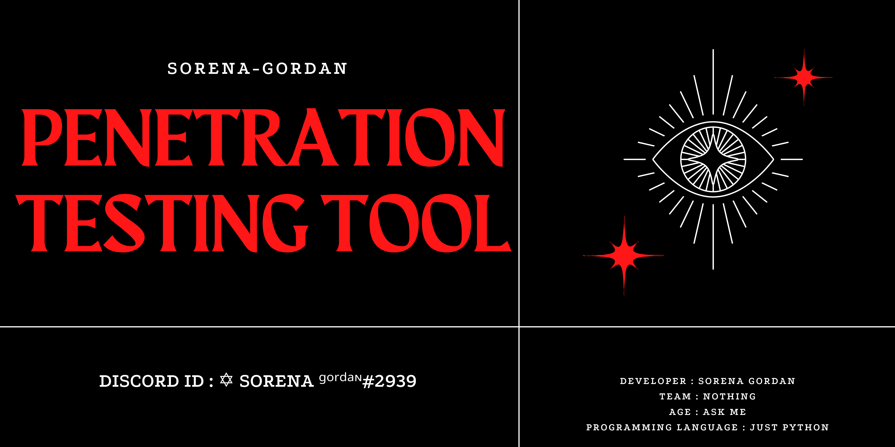

<hl>
 
<h3>Tools</h3>
<ol>
  <li>Bypass cd</li>
  <li>Admin finder</li>
  <li>brotforce</li>
  <li>dns lookup</li>
  <li>ip location</li>
  <li>revirceadress</li>
  <li>scanner port</li>
  <li>see techolojy</li>
  <li>who is</li>
  <li>find user name wp</li>
  <li>find plugin wp</li>
</ol> 
<hl>
 
<h3>other(FUN)</h3>
<ol>
    <li>verify email</li>
    <li>send message whatsapp[beta]</li>
    <li>handwriter</li>
</ol>
<hl>
 
<h2>connect with me</h2>
 

